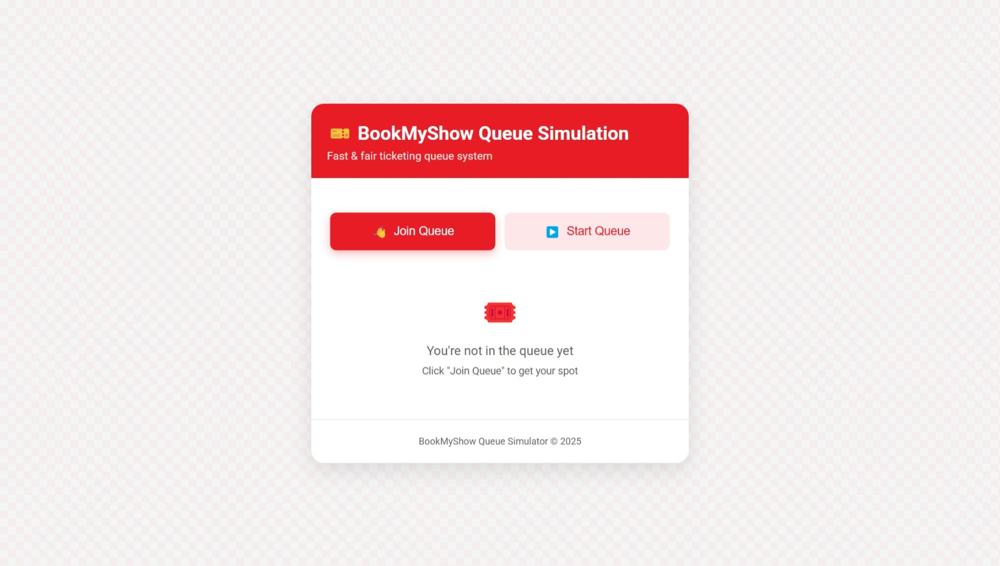
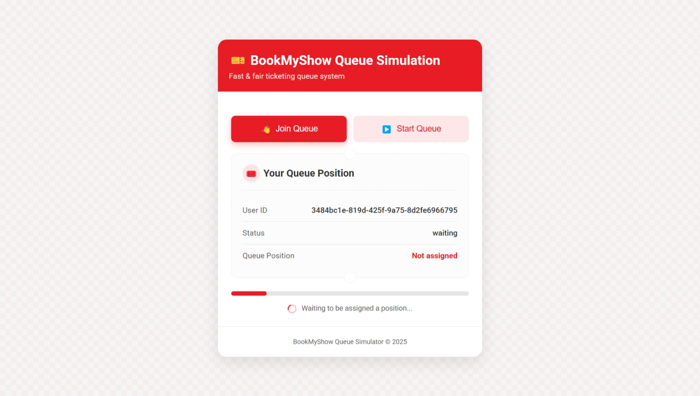
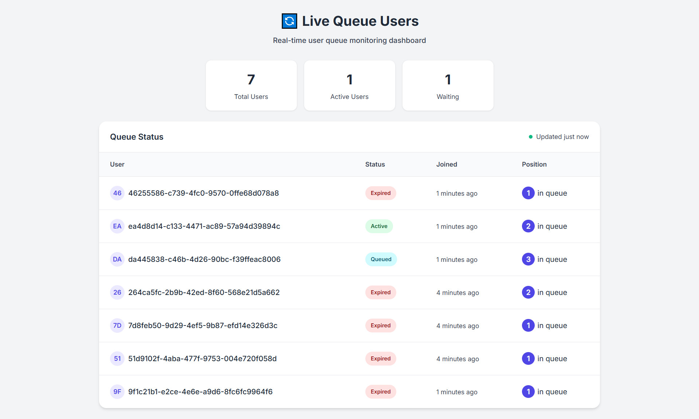

# 🎫 Queue Randomization System

A BookMyShow-inspired automated queue management system — built after surviving the Travis Scott ticket war.

When Travis Scott announced his India tour, I jumped on BookMyShow like everyone else.
What followed? A chaotic digital stampede and a mysterious queue randomization system that decided who vibes to Sicko Mode and who just… refreshes.

This project is my deep dive into that madness:
A simulation of automated queue management, built in Go, that fairly randomizes user positions during high-traffic events — like concerts, flash sales, or anything with FOMO potential.


## 📖 Overview

This project simulates the queue management system used by platforms like BookMyShow during high-demand ticket sales. Instead of serving users in a "first-come-first-served" basis (which can lead to server crashes and unfair advantages), this system:

1. Places all users in a waiting room
2. Randomly assigns queue positions when processing starts
3. Processes users one by one, giving each an exclusive booking session

## ✨ Features

- **Fair Queue Randomization**: All users have an equal chance regardless of when they joined
- **Real-time Status Updates**: Users can see their current position and status
- **Admin Dashboard**: Monitor all users in the queue system

- **Thread-Safe Operations**: Proper mutex implementation for concurrent requests

## 🛠️ Tech Stack

- **Backend**: Go (Golang)
- **Frontend**: HTML, CSS, JavaScript
- **Concurrency**: Go routines and mutex for thread safety
- **User ID Generation**: UUID for unique identification

## 🏗️ Architecture

The system consists of three main components:

### 1. User Management
- Each user gets a unique ID and joins with "waiting" status
- Status transitions: waiting → queued → active → expired

### 2. Queue Processing
- Random shuffling algorithm to assign positions
- Sequential processing of users in queue order
- Configurable active session duration

### 3. API Endpoints
- `/join` - Add user to waiting room
- `/status` - Check current status and position
- `/start` - Begin queue randomization and processing
- `/users` - Admin view of all users in the system

## 📊 Queue States

| Status  | Description |
|---------|-------------|
| waiting | User has joined but queue randomization hasn't started |
| queued  | User has been assigned a position in the queue |
| active  | User's turn to access the booking system |
| expired | User's session has ended |

## 🚀 Getting Started

### Prerequisites
- Go 1.16 or higher
- Web browser

### Installation

1. Clone the repository
```bash
git clone https://github.com/Adit0507/queue-randomization-system.git
cd queue-randomization-system
```

2. Install dependencies
```bash
go mod tidy
```

3. Run the application
```bash
go run .
```

4. Access the application
- User interface: http://localhost:8080/
- Admin dashboard: http://localhost:8080/users

## 📱 Screenshots

### User Queue Interface

#### Default Page



### Admin Dashboard


## 🔄 How It Works

1. **Joining the Queue**:
   - Users access the system and click "Join Queue"
   - They receive a unique ID and enter the waiting room
   
2. **Queue Randomization**:
   - Admin triggers queue processing via "Start Queue" button
   - All waiting users are randomly shuffled and assigned positions
   
3. **Processing Users**:
   - Users are moved to "active" status one by one
   - Each user gets 1 minute to complete their booking
   - After timeout, user status changes to "expired"


## 🙏 Acknowledgements

- Inspired by BookMyShow's queue management system


---

Built with ❤️ by Adi